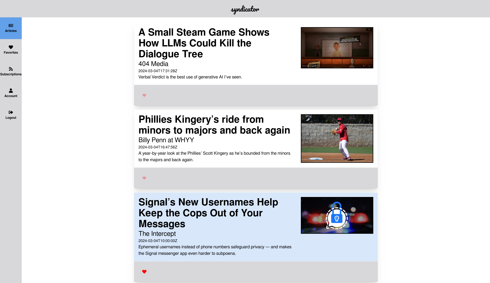

# syndicator

a modern feed aggregator, for readers of writers



## The syndicator philosophy

### The proper place to view articles is on the website where they were published

*syndicator* should enable article discovery but should not attempt to
render the article for the user. A lot of RSS feeds are broken --
they have cut off text or include HTML elements which assume an
included stylesheet -- and full articles are often behind paywalls.
We should link to the articles and not presume we can render them
for the user.

### Use modern standards to build previews

Since RSS was released, Open Graph was created to allow social media
sites create link cards. Publishers spend much more effort making sure
their Open Graph data is presentable than RSS, so if that data is available,
we use it instead of the data in RSS.

## Development

Set up the API

```bash
virtualenv s-api
. ./s-api/bin/activate
cd syndicatorapi
pip install -r requirements.txt
./manage.py migrate
./manage.py runserver
```

Separately, set up the SvelteKit frontend:

```bash
cd syndicator-web
npm i
npm run dev
```

### Regenerating TypeScript types from Django Ninja API

Inside `syndicator-web` with the api dev server running:

```bash
 npx openapi-typescript http://127.0.0.1:8000/openapi.json -o src/lib/apiTypes.d.ts
```